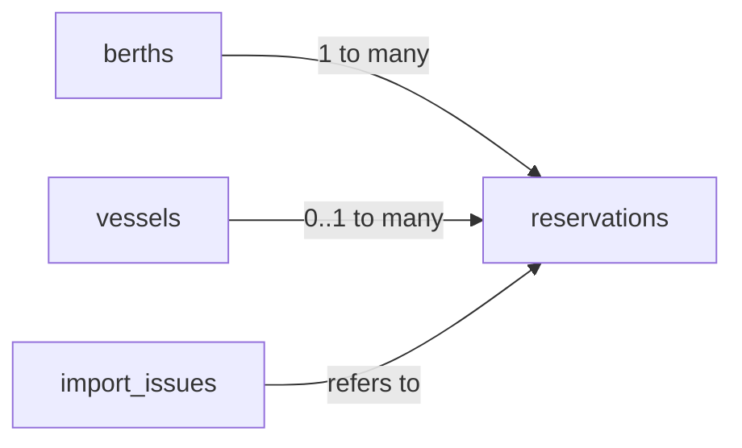
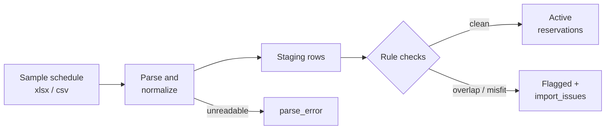

# PRD: Berth — Dock Scheduling System

2026-09-19 · Ahaan

## Overview

Berth is a web app that lets harbor staff book berths for vessels and events, and it refuses any booking that overlaps another or doesn't fit the berth. It replaces a manual grid where staff look for double-bookings and length mismatches by eye.

**Problem.** A WHOI marine facility manages berths of different lengths. Vessels reserve a berth for a range of days, and non-vessel events (such as community sail days) also occupy berths. The current 23-year schedule is checked by hand, so double-bookings and oversized vessels slip through.

**Goals**

1. Make double-bookings impossible, enforced by the database and not just the UI.
2. Make it impossible to assign a vessel to a berth it doesn't fit.
3. Suggest the best available berth for a request so staff don't have to search.
4. Import the 23-year legacy schedule and report every existing conflict and misfit.
5. Show the schedule as a visual timeline that replaces the manual grid.

**Success criteria**

| Metric | Target |
| --- | --- |
| Double-bookings creatable via UI or API | 0 |
| Misfit vessel assignments creatable | 0 |
| Legacy rows imported or explicitly flagged | 100% |
| Time to book a vessel (form open → saved) | < 30 seconds |
| Timeline load time for one year of data | < 1 second |
| Public live URL submitted | By Sun Sep 20, 11:59 PM |

## Users and core problems

The primary user is the harbor coordinator, who books berths and answers "is anything free?" questions many times a day.

| User | What they do | Pain today | What Berth gives them |
| --- | --- | --- | --- |
| Harbor coordinator | Creates, edits and cancels bookings | Scans a grid by eye for overlaps; checks lengths by hand | Automatic conflict and fit checks; berth suggestions |
| Facility manager | Plans capacity and seasons | No view of utilization across years | Timeline and utilization stats |
| Events staff | Schedules sail days and community events | Events fight vessels for space informally | Events booked through the same rules as vessels |
| Vessel captain (future) | Requests a berth | Emails back and forth | Out of scope for MVP; noted as future work |

## Assumptions

Every assumption below is a deliberate choice, documented in the README and configurable where noted.

| # | Assumption | Why | Configurable? |
| --- | --- | --- | --- |
| A1 | Bookings are whole days; start and end dates are both inclusive in the UI | Matches how the legacy grid reads (a vessel "in" on both days) | No |
| A2 | Internally dates are stored as half-open ranges `[start, end + 1)` | Makes overlap math exact: back-to-back bookings don't collide | No |
| A3 | A vessel fits if `vessel.length_ft + margin_ft <= berth.length_ft` | Real berths need clearance for fenders and lines | Yes, `margin_ft` default 0 (set per facility) |
| A4 | Events occupy the whole berth and have no length | A sail day blocks the berth regardless of boat size | No |
| A5 | One booking occupies exactly one berth | Rafting or split berths aren't in the brief | No, future work |
| A6 | All lengths are in feet; imported meters are converted | One unit avoids silent mismatches | Display unit could be toggled later |
| A7 | Same-day turnover (one leaves, next arrives the same day) counts as a conflict | Safer default; A1 inclusive dates imply it | Could relax later |
| A8 | Legacy data is imported as-is, even if it breaks rules, and flagged | History shouldn't be silently altered | Flagged rows can be fixed in-app |
| A9 | Single facility, single time zone (America/New_York) | Matches the brief | No |
| A10 | No authentication for the demo; a real deploy would add staff login | Keeps the 3–5 hour scope | Future work |

## Scope

The MVP covers booking, validation, suggestion, legacy import and a timeline; everything account- or money-related is out.

**In scope (MVP)**

- Manage berths (name, length) and vessels (name, length, type)
- Create, edit and cancel reservations for vessels and events
- Hard rules: no overlaps on a berth, vessel must fit berth
- Berth auto-suggest with ranked alternatives
- Import the legacy schedule, with an audit report of conflicts and misfits
- Timeline view (berths × days) with conflicts highlighted
- Basic utilization stats (per berth, per month, per year)
- Search and filter by vessel, berth and date range

**Out of scope (documented as future work)**

- User accounts, roles and permissions
- Payments, invoicing and notifications
- Captain-facing request portal
- Multi-facility support
- Tide, draft or beam constraints (length only)
- Automatic re-optimization that moves existing bookings

## Data model

Four tables; vessels and events share one `reservations` table so a single overlap rule covers both.



A reservation points to a vessel (a vessel booking) or has no vessel and an event title (an event).

**berths**

| Column | Type | Notes |
| --- | --- | --- |
| id | serial PK | |
| name | text, unique | e.g. "Pier 1 North" |
| length_ft | numeric > 0 | Max vessel length |
| notes | text | Optional |

**vessels**

| Column | Type | Notes |
| --- | --- | --- |
| id | serial PK | |
| name | text, unique | e.g. "R/V Atlantis" |
| length_ft | numeric > 0 | Length overall (LOA) |
| type | text | Research, visiting, private, etc. |

**reservations**

| Column | Type | Notes |
| --- | --- | --- |
| id | serial PK | |
| berth_id | FK → berths | Required |
| vessel_id | FK → vessels, nullable | Null means event |
| kind | enum `vessel` \| `event` | |
| title | text | Event name, or optional note for vessels |
| during | daterange `[start, end)` | Half-open (A2) |
| status | enum `active` \| `cancelled` \| `flagged` | Only active rows are checked by the overlap rule; flagged = legacy rows that break a rule |
| source | enum `manual` \| `legacy_import` | |
| created_at | timestamptz | |

**import_issues**

| Column | Type | Notes |
| --- | --- | --- |
| id | serial PK | |
| reservation_id | FK, nullable | Null if the row couldn't be parsed |
| kind | enum `overlap` \| `misfit` \| `parse_error` \| `unknown_berth` | |
| detail | jsonb | Raw row and conflicting reservation ids |
| resolved | boolean | Staff can mark fixed |

**Database-level rules (the core guarantee)**

```sql
-- No two active reservations on the same berth may overlap
CREATE EXTENSION IF NOT EXISTS btree_gist;
ALTER TABLE reservations ADD CONSTRAINT no_double_booking
  EXCLUDE USING gist (berth_id WITH =, during WITH &&)
  WHERE (status = 'active');

-- Vessel bookings need a vessel; events need a title
ALTER TABLE reservations ADD CONSTRAINT kind_shape CHECK (
  (kind = 'vessel' AND vessel_id IS NOT NULL) OR
  (kind = 'event'  AND vessel_id IS NULL AND title IS NOT NULL));
```

The fit rule spans two tables, so a `BEFORE INSERT OR UPDATE` trigger enforces it by comparing `vessels.length_ft + margin_ft` to `berths.length_ft` (active rows only). Legacy rows that break either rule get `status = 'flagged'`. The constraint only checks `active` rows, so flagged history still loads and each problem is listed in `import_issues`.

## Functional requirements

P0 items must ship for the submission; P1 items ship if time allows.

| ID | Priority | Requirement | Acceptance criteria |
| --- | --- | --- | --- |
| FR1 | P0 | Create a vessel reservation (vessel, berth, start, end) | Saved and visible on the timeline; end before start is rejected |
| FR2 | P0 | Create an event reservation (title, berth, start, end) | Same as FR1; no vessel required |
| FR3 | P0 | Reject overlapping bookings on a berth | API returns 409 with the conflicting booking's vessel/event and dates; UI shows it inline |
| FR4 | P0 | Reject vessels that don't fit | API returns 422: "R/V X is 62 ft; Berth 3 is 50 ft" |
| FR5 | P0 | Suggest berths for a vessel + date range | Returns ranked free berths that fit; best fit first (see algorithm) |
| FR6 | P0 | Import the legacy schedule | Every row is imported or listed as a parse error; counts shown after import |
| FR7 | P0 | Audit report | Lists every overlap and misfit in history, filterable by year, berth and type |
| FR8 | P0 | Timeline view | Berths as rows, days as columns, bookings as bars; flagged bookings in red; scroll by month |
| FR9 | P0 | Edit and cancel a reservation | Edits re-run both rules; cancelled bookings free the berth immediately |
| FR10 | P0 | Manage berths and vessels | Create and edit; lowering a berth's length warns if it breaks future bookings |
| FR11 | P1 | Alternatives when nothing fits | Offers nearest free dates on a fitting berth and berths that free up within N days |
| FR12 | P1 | Utilization stats | Occupancy % per berth per month/year; busiest season; small chart |
| FR13 | P1 | Search and filter | By vessel, berth, event and date range |
| FR14 | P1 | Fix a flagged legacy booking | Reassign to a suggested berth or cancel; issue marked resolved |
| FR15 | P1 | Export | Download the current schedule as CSV |

## Berth auto-suggest algorithm

Suggest the smallest free berth the vessel fits in (best-fit), so large berths stay open for large vessels.

**Inputs:** vessel length (or "event"), start date, end date. **Output:** a ranked list of berths with a short reason each.

1. **Filter by fit.** Keep berths where `vessel.length_ft + margin_ft <= berth.length_ft`. Events skip this step.
2. **Filter by availability.** Drop berths with any active reservation overlapping `[start, end + 1)`. One SQL query using `&&` on the GiST index.
3. **Rank by slack.** Sort by `berth.length_ft - vessel.length_ft`, smallest first. Break ties by berth name for determinism.
4. **Label.** Top result is "Best fit"; others show slack ("12 ft spare").
5. **If empty, fall back to alternatives (FR11):**
   - Same berths, nearest start date within ±14 days where the whole stay fits
   - Berths that become free partway through ("Berth 4 is free from Jun 3")
   - Report the reason: "No berth ≥ 62 ft exists" vs "All fitting berths are booked"

```sql
SELECT b.*, b.length_ft - :vessel_len AS slack_ft
FROM berths b
WHERE b.length_ft >= :vessel_len + :margin
  AND NOT EXISTS (
    SELECT 1 FROM reservations r
    WHERE r.berth_id = b.id AND r.status = 'active'
      AND r.during && daterange(:start, :end + 1, '[)'))
ORDER BY slack_ft, b.name;
```

**Why best-fit.** It is the classic heuristic for bin-packing-style assignment. It's simple to explain, runs in one query, and measurably keeps large berths available. The README can show this with the legacy data: replay history with best-fit and count how many bookings would have been rejected versus the original assignments.

**Complexity.** With B berths and a GiST index, a suggestion runs in roughly O(B log N) for N reservations, well under 50 ms for 23 years of data.

## Legacy import and audit

The importer turns the 23-year sample schedule into clean reservations and produces an audit report. That report is the demo's headline: "Found X double-bookings and Y misfits the old grid missed."



Every source row ends up in exactly one of three places, so nothing is lost silently.

**Parsing steps** (adapt once the real file's format is known)

1. **Detect layout.** If it's a grid (berths × days with names in cells), convert runs of consecutive identical cells into one reservation each. If it's a list (one row per booking), map columns directly.
2. **Normalize names.** Trim, case-fold and collapse spacing so "R/V Atlantis" and "RV atlantis " match one vessel. Keep a small alias map for anything ambiguous.
3. **Normalize dates and units.** Parse mixed date formats; convert meters to feet (A6).
4. **Classify.** Entries without a known vessel, or with keywords like "sail day", "regatta" or "event", become events.
5. **Check and load.** Process rows in chronological order. A row that overlaps an already-loaded active booking, or doesn't fit, is loaded as flagged, with an issue recording both reservation ids.
6. **Idempotent.** Re-running the import on the same file produces the same result (hash of the source row as a dedupe key).

**Audit report contents**

| Section | Shows |
| --- | --- |
| Summary | Rows read, imported clean, flagged, parse errors |
| Double-bookings | Berth, dates, both parties, overlap length in days |
| Misfits | Vessel, length, berth, berth length, shortfall in ft |
| By year | Issues per year (small bar chart); spots bad seasons |
| Unknowns | Unrecognized berths or vessels needing a human decision |

Each issue links to the timeline at that date, and FR14 lets staff fix it with a suggested berth.

## Screens and UX

Four core screens plus a P1 stats page; the timeline is home and everything else is one click from it.

| Screen | Purpose | Key elements |
| --- | --- | --- |
| Timeline (home) | See who's where, at a glance | Berths as rows (with length), days as columns; vessel bars in blue, events in green, flagged in red; month picker; "today" line; click empty cell to book, click a bar to edit |
| New booking panel | Book in under 30 seconds | Vessel or event toggle; vessel search; date range; live list of suggested berths with "Best fit" badge; conflict/fit errors shown inline before saving |
| Audit | Show legacy problems | Summary counts; tabs for Double-bookings, Misfits, Unknowns; filters by year and berth; "View on timeline" and "Fix" per row |
| Berths & vessels | Reference data | Editable tables; warning when a change breaks a future booking |
| Stats (P1) | Capacity planning | Occupancy % per berth, per month; busiest months across all years |

**UX rules**

- Validate as the user types: suggestions and conflicts update when dates change, not only on submit.
- Errors say what's wrong and what to do: "Berth 3 is booked by R/V Tioga Jun 2–6. Try Berth 5 (best fit)."
- Keyboard-friendly form; works on a laptop screen; mobile is view-only.

## Architecture and tech stack

One Next.js app with a Postgres database, deployed on Vercel with Neon, giving a free public URL in minutes.

| Layer | Choice | Why |
| --- | --- | --- |
| Frontend | Next.js (App Router) + React + Tailwind | Fast to build, one repo for UI and API |
| Timeline | Custom CSS grid (or `react-calendar-timeline`) | Full control of colors and click-to-book |
| API | Next.js route handlers | No separate server to deploy |
| Database | Postgres (Neon) | `daterange` and exclusion constraints do the heavy lifting |
| ORM / queries | Drizzle or raw SQL via `postgres.js` | Needs raw SQL for `&&` and constraints anyway |
| Import | Node script (`scripts/import.ts`) using `xlsx` / `csv-parse` | Run once locally against Neon; also an upload page if time |
| Tests | Vitest | Rules and suggest logic |
| Hosting | Vercel + Neon free tiers | Public URL, zero ops |

A Python alternative (FastAPI + SQLite + HTMX on Render) works too. Postgres is recommended because its exclusion constraint is the strongest way to prove "double-bookings are impossible".

**API endpoints**

| Method | Path | Does |
| --- | --- | --- |
| GET | /api/reservations?from=&to=&berth= | Reservations in a window (timeline) |
| POST | /api/reservations | Create; 409 on overlap, 422 on misfit |
| PATCH | /api/reservations/:id | Edit or cancel; same rules |
| GET | /api/suggest?vessel=&start=&end= | Ranked berths + alternatives |
| GET/POST/PATCH | /api/berths, /api/vessels | Reference data |
| GET | /api/audit?year=&kind= | Import issues |
| POST | /api/import | Upload a legacy file (P1) |
| GET | /api/stats?year= | Utilization (P1) |

The API maps Postgres error `23P01` (exclusion violation) to a friendly 409 that names the conflicting booking. The UI never has to be trusted to prevent a conflict.

## Testing and verification

Tests focus on the two rules and the suggester, because those are the promises the system makes.

| Area | Cases |
| --- | --- |
| Overlap rule | Exact same dates; partial overlap at start and end; one booking inside another; back-to-back (Jun 1–5 then Jun 6–10 allowed); same-day turnover rejected (A7); cancelled booking frees the slot |
| Fit rule | Vessel equal to berth length (allowed at margin 0); 1 ft over (rejected); margin setting applied; editing a berth shorter than a future booking warns |
| Events | Event blocks a vessel and vice versa; event with no title rejected |
| Suggester | Picks smallest fitting berth; excludes booked berths; empty result gives correct reason; deterministic ordering |
| Import | Grid runs collapse to one booking; name variants merge; known bad rows are flagged, not dropped; re-import is idempotent; totals reconcile (read = clean + flagged + errors) |
| API | 409 and 422 bodies name the conflict; bad dates return 400 |

**Manual check before submitting:** open the live URL in a private window, book a vessel, try to double-book it, try an oversized vessel, open the audit page, and confirm the counts match the import log.

## Build plan

About 5 hours of focused work, deployed early so the public URL exists from hour 1.

| Block | Time | Deliverable |
| --- | --- | --- |
| 1 | 0:00–0:45 | Scaffold Next.js, create Neon DB, schema + exclusion constraint + fit trigger, deploy "hello" to Vercel |
| 2 | 0:45–1:45 | Import script: parse sample schedule, normalize, load, write import_issues; print summary |
| 3 | 1:45–2:30 | Reservations API (create/edit/cancel) with 409/422 mapping; suggest endpoint; unit tests for rules |
| 4 | 2:30–3:45 | Timeline view + booking panel with live suggestions and inline errors |
| 5 | 3:45–4:30 | Audit page (summary + tables + links to timeline) |
| 6 | 4:30–5:00 | README, seed prod DB, manual end-to-end check, submit form |
| Stretch | if time | Stats chart, fix-flagged flow, CSV export, alternatives when nothing fits |

**Cut order if time runs short:** stats → alternatives → fix flow → edit (keep cancel). Never cut the DB constraints, the audit page or the README; they're what the reviewers are grading.

## README outline and future work

The README is half the grade ("how clearly you can explain your decisions"), so it gets its own 30 minutes.

1. **What it is.** One paragraph + live URL + 3 screenshots (timeline, booking with suggestion, audit).
2. **Headline finding.** "Importing 23 years of bookings found X double-bookings and Y misfits."
3. **How to use it.** Book a vessel, book an event, read the audit.
4. **Key decisions.** Why a DB constraint and not UI checks; why vessels and events share one table; why best-fit; half-open date ranges.
5. **Assumptions.** The A1–A10 table from this PRD.
6. **Data cleaning.** What was messy in the source and how it was handled.
7. **Testing.** What's covered and how to run it.
8. **Tradeoffs and future work.** See below.
9. **Time spent.** Honest breakdown, around 5 hours.

**Future work**

- Staff login with roles (coordinator vs viewer) and an audit log of who changed what
- Captain request portal with approve/decline workflow
- Beam, draft and tide constraints alongside length
- Rafting (multiple small vessels sharing a berth)
- Global re-optimization: propose moving existing bookings to fit a new large vessel
- Email/SMS reminders and iCal feeds per berth
